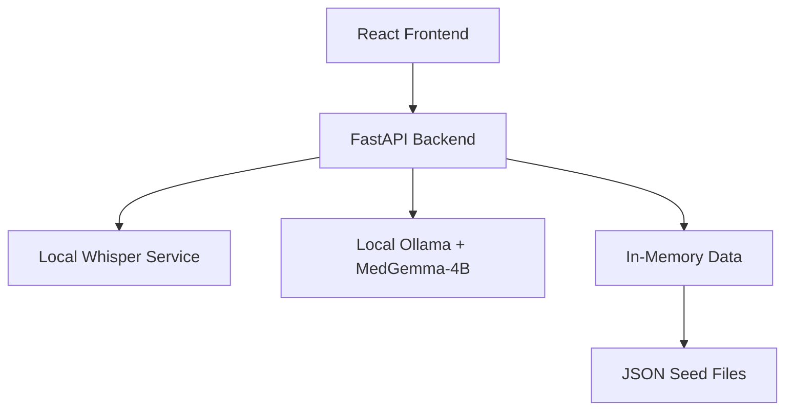

# Design Document

## Overview

Dhanvantri is a simple multilingual healthcare chatbot with voice capabilities, similar to ChatGPT but focused on health topics. The system operates locally using Ollama (MedGemma-4B) for medical responses and Whisper for speech-to-text/translation across 5 languages: English, Hindi, Bengali, Bhojpuri, and Kannada.

The system runs completely offline and provides a minimal dark UI for easy interaction via text or voice.

## Architecture

### High-Level Architecture



### Component Architecture

Simple 3-layer architecture:

1. **Frontend**: React app with voice controls and dark UI
2. **Backend**: FastAPI with chat endpoint and health checks  
3. **Services**: Local Ollama and Whisper for LLM and translation

### Configuration Management

Environment-driven configuration with typed config objects:

- `OLLAMA_BASE`: Local Ollama service URL (default: http://localhost:11434)
- `MODEL_NAME`: LLM model name (default: MedGemma-4B)
- `WHISPER_BASE`: Local Whisper service URL (default: http://localhost:5000)
- `ENABLE_PRODUCTION_FEATURES`: Feature flags for production capabilities
- `LOG_LEVEL`, `PORT`: Standard service configuration

## Components and Interfaces

### Backend Components

#### Configuration Module (`config.py`)
- Centralized configuration management using Pydantic settings
- Environment variable loading with validation and defaults
- Typed configuration objects accessible across modules

#### External Service Clients

**Whisper Client (`whisper_client.py`)**
```python
class WhisperClient:
    def transcribe_audio_bytes(self, audio_bytes: bytes, language: str = None) -> dict:
        """Returns {text: str, language: str, confidence: float}"""
    
    def translate_text(self, text: str, source_lang: str, target_lang: str) -> str:
        """Translates text between supported languages"""
```

**Ollama Client (`ollama_client.py`)**
```python
def ollama_chat(prompt: str, system_prompt: str, temperature: float = 0.1) -> str:
    """Wrapper for Ollama API with retry logic and error handling"""
```

#### Data Layer

**Simple In-Memory Storage (`in_memory.py`)**
- Loads medical facts from JSON files at startup
- Stores chat history in memory during session
- Basic keyword search for medical context

#### Business Logic

**Translation Service (`translate.py`)**
- Thin wrapper around Whisper client
- Language detection and translation coordination
- Error handling for unsupported languages

**Utility Functions (`utils.py`)**
- System prompt construction for medical conversations
- Medical disclaimer appending
- Basic text processing helpers

#### API Routes

**Chat Route (`routes/chat.py`)**
- Handles POST /api/chat with audio and text input support
- Implements the core conversation flow:
  1. Audio transcription (if provided)
  2. Translation to English for processing
  3. LLM interaction with MedGemma-4B
  4. Response translation and disclaimer appending

**Health Route (`routes/health.py`)**
- Service health monitoring
- External service connectivity verification
- Basic metrics and observability

### Frontend Components

#### Main Application (`App.jsx`)
- Single-page chat interface with dark theme
- Language selector and user session management
- Message display with source attribution
- Error handling and user feedback

#### Voice Controls (`VoiceControls.jsx`)
- Web Speech API integration for local STT
- Audio recording and base64 encoding for server-side Whisper
- Toggle between local and server-side speech processing
- Text-to-speech output using browser speechSynthesis

## Data Models

### Core Data Structures

```typescript
interface ChatMessage {
  id: string;
  user_id?: number;
  message: string;
  language: string;
  timestamp: Date;
  is_user: boolean;
  sources?: SourceReference[];
  translation_unavailable?: boolean;
}

interface SourceReference {
  title: string;
  source: string;
  language: string;
}

interface DiseaseSnippet {
  id: string;
  title: string;
  content_en: string;
  content_hi?: string;
  content_bn?: string;
  content_bho?: string;
  content_kn?: string;
  keywords: string[];
  source: string;
}

interface User {
  id: number;
  name: string;
  preferred_language: string;
  created_at: Date;
}
```

### Seed Data Structure

**disease_facts.json**
```json
[
  {
    "id": "diabetes_basics",
    "title": "Diabetes Management",
    "content_en": "Diabetes is a condition where blood sugar levels are too high...",
    "keywords": ["diabetes", "blood sugar", "insulin"],
    "source": "WHO Guidelines"
  }
]
```

**users_seed.json**
```json
[
  {
    "id": 1,
    "name": "Demo User",
    "preferred_language": "en",
    "created_at": "2024-01-01T00:00:00Z"
  }
]
```

## Error Handling

### Error Categories and Responses

1. **Translation Unavailable (400)**
   ```json
   {
     "error": "translation_unavailable",
     "message": "Whisper unavailable or language unsupported"
   }
   ```

2. **Service Unavailable (503)**
   ```json
   {
     "error": "service_unavailable", 
     "message": "External service temporarily unavailable"
   }
   ```

3. **Normal Response (200)**
   ```json
   {
     "reply": "Based on your question about diabetes...",
     "sources": [],
     "translation_unavailable": false
   }
   ```

### Error Handling Strategy

- **Graceful Degradation**: When Whisper is unavailable, provide responses in English with clear messaging
- **Retry Logic**: Implement exponential backoff for transient service failures
- **User Feedback**: Clear error messages in the UI explaining service availability
- **Fallback Modes**: Local browser STT when server-side Whisper is unavailable

## Testing Strategy

### Core Testing Approach

Given the constraint of no test files in the repository, the testing strategy focuses on:

1. **Manual Verification Checklist**
   - STT/translation via Whisper service
   - Red-flag detection bypass of LLM
   - End-to-end LLM response flow
   - UI text-to-speech functionality
   - Error handling for service unavailability

2. **Health Check Endpoints**
   - Automated service connectivity verification
   - Basic functionality validation through /health endpoint

3. **Development Testing**
   - Clear runbook with verification steps
   - Sample requests and expected responses
   - Service dependency validation commands

### Future Testing Extensions

When tests are added later, the modular architecture supports:
- Unit tests for individual components
- Integration tests for service interactions
- End-to-end tests for complete user flows
- Mock implementations for external services

## Core Features

### Chat Flow
1. User inputs text or voice in any supported language
2. If voice: Whisper converts speech to text and detects language  
3. Translate to English if needed, get LLM response from MedGemma-4B
4. Translate response back to user's language
5. Add medical disclaimer to response
6. Frontend plays response using text-to-speech

### Voice Features
- **Input**: Web Speech API (local) or Whisper service (server-side)
- **Output**: Browser speechSynthesis API with language-specific voices
- **Languages**: English (en), Hindi (hi), Bengali (bn), Bhojpuri (bho), Kannada (kn)
- **Fallback**: Clear error messages when Whisper unavailable

### Core Features
- **Medical Chatbot**: Natural conversation about health topics using MedGemma-4B
- **Multilingual**: Automatic translation between 5 supported languages
- **Voice Interface**: Speech input and audio output for accessibility
- **Medical Disclaimer**: Standard disclaimer appended to responses